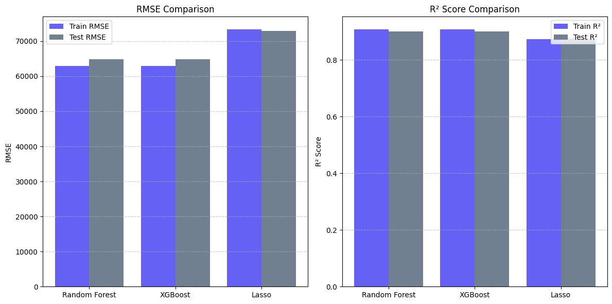
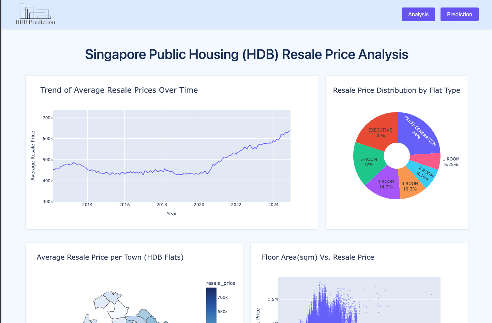
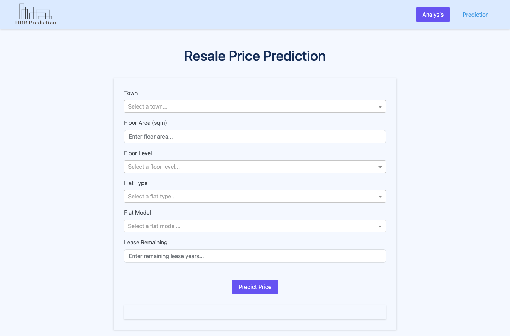

# HDB Resale Price Prediction and Analysis

This project predicts HDB resale prices in Singapore using machine learning, providing a powerful tool for both buyers and sellers to make informed financial decisions.

➡️ **[Live Demo of the Interactive Dashboard](https://hdb-resale-prices-prediction.onrender.com/)**

---

## 1. The Business Problem

For hundreds of thousands of Singaporeans, buying or selling an HDB flat is the most significant financial decision of their lives. The market is complex, and accurately valuing a flat is challenging, leading to uncertainty and potential financial loss.

- **Buyers** risk overpaying.
- **Sellers** risk undervaluing their property.

Our project tackled this problem by building a tool to replace guesswork with data-driven valuation insights, empowering users to make confident decisions.

---

## 2. My Technical Approach

To solve this, I developed an end-to-end data science pipeline:

- **Data Collection & Merging**: Gathered over 100,000 transaction records from [data.gov.sg](https://data.gov.sg), along with MRT station locations and historical price indices.
- **Geocoding**: Used the OneMap API to convert addresses into coordinates.
- **Feature Engineering**: Calculated the precise distance from each flat to the nearest MRT station.
- **Data Cleaning & Inflation Adjustment**: Standardized prices to reflect consistent value over time.
- **Model Training**: Evaluated several machine learning models.
- **Final Model**: Selected an **XGBoost Regressor** for its superior accuracy.
- **Deployment**: Built an interactive web application using **Plotly Dash**.

---

## 3. The Solution & Key Findings

The final product is a user-friendly web dashboard with two main tools:

### 🧭 Analysis Page
- Explore historical price trends.
- View price distributions by flat type.
- Interactive heat map of average prices across all towns in Singapore.

### 📈 Prediction Page
- Input specific flat details (e.g., town, floor area, remaining lease).
- Receive **instant price prediction** powered by machine learning.

### 📊 Model Performance
- **R² Score**: > 0.97 (explains 97%+ of price variance)
- **Average Error**: ±5.8%

**Key Findings**:
- Floor area and remaining lease are major value drivers.
- Proximity to MRT stations significantly impacts price.

---

## 4. Business Impact

This project transforms complex datasets into **accessible financial insights** for everyday Singaporeans:

### ✅ Empowering Buyers
Verify if a listing is fairly priced and gain confidence in negotiations.

### ✅ Maximizing Seller Returns
Set a competitive, data-driven price to avoid undervaluation.

### ✅ Democratizing Data
Put advanced market intelligence—once exclusive to property agents—into the hands of everyone. Understand how specific features (e.g., high floor, MRT proximity) affect a property's value.

---

## Table of Contents
1.  [Introduction](#introduction)
2.  [Project Goal](#project-goal)
3.  [Dataset](#dataset)
4.  [Methodology](#methodology)
    *   [A. Data Collection & Preprocessing](#a-data-collection--preprocessing)
    *   [B. Exploratory Data Analysis (EDA)](#b-exploratory-data-analysis-eda)
    *   [C. Feature Engineering](#c-feature-engineering)
    *   [D. Model Development & Evaluation](#d-model-development--evaluation)
    *   [E. Error Analysis](#e-error-analysis)
5.  [Interactive Dashboard (Built with Plotly Dash)](#interactive-dashboard-built-with-plotly-dash)
    *   [A. Analysis Page](#a-analysis-page)
    *   [B. Prediction Page](#b-prediction-page)
6.  [Project Structure](#project-structure)
7.  [Tools and Technologies](#tools-and-technologies)
8.  [How to Run the Project](#how-to-run-the-project)
9.  [Key Results & Findings](#key-results--findings)
10. [Future Enhancements](#future-enhancements)
11. [Author](#author)

---

## Introduction

This project focuses on the prediction of HDB (Housing & Development Board) resale flat prices in Singapore. HDB flats constitute the vast majority of housing in Singapore, making their pricing a topic of significant interest to residents, potential buyers, and policymakers.

**Motivation:**
The primary motivation behind this project is to apply data science techniques to a real-world problem that has a tangible impact on many people. It serves as an opportunity to:
1.  Demonstrate proficiency in various stages of a data science project, including data collection, cleaning, exploratory data analysis, feature engineering, model building, and deployment of an interactive dashboard.
2.  Utilize Python and its rich ecosystem of libraries (Pandas, Scikit-learn, XGBoost, Plotly Dash) to develop an end-to-end solution.
3.  Create a meaningful project for a data science portfolio, showcasing the ability to derive insights and build predictive tools.
4.  Gain a deeper understanding of the Singaporean housing market, particularly the factors influencing HDB resale prices.

---

## Project Goal

The main goals of this project are:
1.  To develop a robust machine learning model capable of accurately predicting the resale prices of HDB flats based on various features such as location, flat type, floor area, remaining lease, and proximity to amenities.
2.  To create an interactive web-based dashboard that allows users to:
    *   Explore historical HDB resale price trends and patterns through various visualizations.
    *   Obtain price predictions for HDB flats based on user-specified criteria.

---

## Dataset

The project utilizes several publicly available datasets:

*   **HDB Resale Flat Prices:** Sourced from [data.gov.sg](https://data.gov.sg/collections/189/view). This includes multiple CSV files covering different time periods:
    *   `flat_data( Mar 2012 to Dec 2014).csv`
    *   `flat_data(Jan 2015 to Dec 2016).csv`
    *   `flat_data(Jan-2017 onwards).csv`
*   **MRT Station Locations:** A GeoJSON file (`MRT.geojson`) from [data.gov.sg](https://data.gov.sg/dataset/mrt-station-location-geojson) containing the geographical coordinates and names of MRT stations.
*   **Resale Price Index (RPI):** A CSV file (`resale_price_index.csv`) from [data.gov.sg](https://data.gov.sg/dataset/hdb-resale-price-index) used to adjust historical resale prices to a common baseline.
*   **Geospatial Data for Addresses:** The OneMap API ([OneMap API](https://www.onemap.gov.sg/apidocs/)) was used to fetch latitude and longitude coordinates for HDB block addresses. The results of this process are stored in `data/clean_hdb_coordinate_data.csv`.
*   **Singapore Town Boundaries:** A GeoJSON file (`singapore_town_boundaries.json`) used for creating choropleth map visualizations in the dashboard.

**Key Data Files Generated/Used in the Project:**
*   `data/clean_hdb_resale_data.csv`: The primary cleaned and merged dataset used for exploratory data analysis and model training. It includes features like distance to the nearest MRT and adjusted resale prices.
*   `data/clean_mrt_data.csv`: Processed MRT station data with extracted station names and coordinates.
*   `data/town_mrt_distances.csv`: A derived dataset containing the average distance from HDB flats to the nearest MRT station for each town.

---

## Methodology

The project followed a structured data science workflow, detailed below:

### A. Data Collection & Preprocessing

1.  **Loading Data:** The raw HDB resale datasets for different time periods were loaded using Pandas.
2.  **MRT Data Processing:**
    *   MRT station data was loaded from `MRT.geojson`.
    *   Station names were extracted from the HTML description field using BeautifulSoup.
    *   Latitude and longitude for each station were extracted.
    *   The cleaned MRT data was saved to `data/clean_mrt_data.csv`.
3.  **HDB Data Wrangling:**
    *   Date columns were converted to datetime objects.
    *   `remaining_lease` was calculated. For older datasets, it was derived from `lease_commence_date` and the transaction year. For newer datasets, it was parsed from a string format.
    *   The three HDB datasets were concatenated into a single DataFrame.
    *   Town names were standardized (e.g., 'KALLANG/WHAMPOA' to 'KALLANG').
    *   Duplicate records were removed.
4.  **Fetching HDB Coordinates:**
    *   A `full_address` column was created by combining `block` and `street_name`.
    *   The OneMap API was used to fetch latitude and longitude for unique addresses. (This step is computationally intensive and the results were saved to `data/clean_hdb_coordinate_data.csv` to avoid repeated API calls).
5.  **Calculating Distance to Nearest MRT:**
    *   Both HDB flat locations and MRT station locations were converted to GeoDataFrames using GeoPandas.
    *   Coordinate Reference Systems (CRS) were standardized (first to EPSG:4326, then to EPSG:3414 for accurate distance calculation in meters).
    *   The `sjoin_nearest` function from GeoPandas was used to find the nearest MRT station for each HDB flat and calculate the distance in meters, which was then converted to kilometers (`distance_km`).
6.  **Adjusting Resale Prices:**
    *   The Resale Price Index (RPI) data was loaded and transformed from wide to long format.
    *   HDB resale prices were adjusted to a common baseline (2024 Q4 RPI) to account for market inflation/deflation over time. The formula used: `adjusted_resale_price = resale_price * (RPI_baseline / RPI_transaction_quarter)`.
7.  **Final Clean Dataset:** The fully processed and enriched dataset was saved as `data/clean_hdb_resale_data.csv`.

### B. Exploratory Data Analysis (EDA)

EDA was performed to uncover patterns, trends, and relationships within the data. Key visualizations and analyses included:
*   **Price Trends:** Line charts showing the trend of average original and adjusted resale prices over time.
*   **Distribution Analysis:** Histograms for `adjusted_resale_price` and `floor_area_sqm`. Bar charts for `flat_type` and `town` distributions.
*   **Price by Categorical Features:** Box plots and bar charts showing average `adjusted_resale_price` by `flat_type`, `town`, and `storey_range`.
*   **Correlation Analysis:**
    *   Scatter plots to visualize relationships between `adjusted_resale_price` and continuous features like `floor_area_sqm`, `remaining_lease`, and `distance_km`.
    *   A heatmap of the correlation matrix for selected numerical features.
*   The EDA provided insights into how different factors influence HDB resale prices, guiding feature engineering and model selection.

### C. Feature Engineering

Based on EDA insights, the following features were engineered for model training:
1.  **Temporal Feature:** `month_no` (month of the transaction) was extracted from the `month` column.
2.  **Storey Range Conversion:** The `storey_range` (e.g., '01 TO 03') was split into numerical `min_storey` and `max_storey`.
3.  **Categorical Encoding:** One-hot encoding (`pd.get_dummies`) was applied to categorical features: `flat_type`, `town`, and `flat_model`. `drop_first=True` was used to avoid multicollinearity.
4.  **Feature Selection:** Irrelevant or redundant columns were dropped (e.g., `block`, `street_name`, `lease_commence_date`, original `resale_price`, geographical coordinates after distance calculation).
5.  The target variable was `adjusted_resale_price`.

### D. Model Development & Evaluation

1.  **Data Splitting:** The dataset was split into training (70%) and testing (30%) sets using `train_test_split` with `random_state=123`.
2.  **Models Implemented:**
    *   **Random Forest Regressor:** An ensemble learning method.
    *   **Lasso Regression:** A linear model with L1 regularization. Input features for Lasso were scaled using `StandardScaler`.
    *   **XGBoost Regressor:** A gradient boosting algorithm known for its performance.
3.  **Hyperparameter Tuning:**
    *   **Random Forest & XGBoost:** `RandomizedSearchCV` was used to find optimal hyperparameters, optimizing for `neg_root_mean_squared_error` (Random Forest) or `neg_mean_absolute_error` (XGBoost) with 3-fold cross-validation.
    *   **Lasso Regression:** `LassoCV` was used to determine the best `alpha` (regularization strength).
4.  **Model Training & Saving:** Models were trained on the training data. The trained models, including those from `RandomizedSearchCV`, were saved as `.pkl` files using `joblib`.
5.  **Evaluation Metrics:**
    *   **Root Mean Squared Error (RMSE):** Measures the average magnitude of the errors.
    *   **R-squared (R²) Score:** Represents the proportion of the variance in the dependent variable that is predictable from the independent variables.
6.  **Model Comparison:** The performance of the tuned models (Random Forest, XGBoost, Lasso) was compared using bar charts for RMSE and R² scores on both training and testing datasets. The XGBoost Regressor generally showed the best performance on the test set.


### E. Error Analysis

For the selected XGBoost model (after `RandomizedSearchCV`):
*   Test RMSE: Approximately S$28,371
*   Mean Adjusted Resale Price: Approximately S$487,258
*   **Error Rate:** (Test RMSE / Mean Adjusted Resale Price) * 100 ≈ **5.82%**. This indicates that the model's predictions may deviate by approximately ±5.82% from the actual resale price on average.

---

## Interactive Dashboard (Built with Plotly Dash)

An interactive dashboard was developed using Plotly Dash and Dash Bootstrap Components to visualize the analysis and provide a prediction tool.

### A. Analysis Page (`pages/analysis.py`)

This page presents various visualizations derived from the HDB resale data:
*   **Overall Trend of Average Resale Prices:** A line chart showing how average HDB resale prices have changed over the years.
*   **Resale Price Distribution by Flat Type:** A pie chart illustrating the proportion of average resale prices for different flat types.
*   **Average Resale Price per Town:** An interactive choropleth map of Singapore, color-coded by the average resale price in each town. Users can click on a town to filter other charts.
*   **Floor Area (sqm) vs. Resale Price:** A scatter plot showing the relationship between the size of the flat and its resale price.
*   **Distribution of Flat Types:** A bar chart showing the count of resale transactions for each flat type.
*   **Average Resale Price by Storey Range:** A bar chart displaying how average resale prices vary across different storey ranges.

**Interactivity:**
*   Clicking on a town in the choropleth map dynamically updates the "Trend of Average Resale Prices" and "Resale Price Distribution by Flat Type" charts to display data specific to the selected town.
*   A "Reset Map" button reverts the filtered charts to show overall data.



### B. Prediction Page (`pages/prediction.py`)

This page provides an interface for users to get HDB resale price predictions:
*   **User Inputs:**
    *   Town (Dropdown)
    *   Floor Area (sqm) (Numeric Input)
    *   Floor Level (Dropdown, e.g., '01 TO 03')
    *   Flat Type (Dropdown, e.g., '4 ROOM')
    *   Flat Model (Dropdown, e.g., 'Model A')
    *   Remaining Lease (Numeric Input, in years)
*   **Prediction Mechanism:**
    1.  When the user clicks the "Predict Price" button, the input values are collected.
    2.  The average distance to the nearest MRT for the selected town is fetched from `data/town_mrt_distances.csv`.
    3.  Categorical inputs are one-hot encoded to match the feature format used during model training.
    4.  The `min_storey` and `max_storey` are extracted from the selected `floorLevel`.
    5.  The current month is used as a feature.
    6.  These features are then fed into the pre-trained XGBoost model (`xgb_random_search_model.pkl`).
*   **Output:** The page displays the predicted HDB resale price (e.g., "Predicted Resale Price is S$ XXX,XXX").


---

## Project Structure

```
HDB-Resale-Prices-Prediction/
├── .DS_Store
├── .gitignore
├── dashboard.py            # Main Dash application script
├── main.ipynb              # Jupyter notebook for data processing, EDA, and model training
├── Procfile                # For Heroku deployment
├── README.md               # Project documentation (this file)
├── requirements.txt        # Python dependencies
├── assets/                 # CSS, logo for dashboard
│   ├── logo.png
│   ├── styles.css
│   ├── model_comparison.png
│   ├── analysis_page.png
│   └── prediction_page.png
├── data/
│   ├── .DS_Store
│   ├── clean_hdb_coordinate_data.csv # HDB flats with lat/lon
│   ├── clean_hdb_resale_data.csv     # Main cleaned dataset for analysis/modeling
│   ├── clean_mrt_data.csv            # Processed MRT station data
│   ├── singapore_town_boundaries.json # GeoJSON for map visualizations
│   ├── town_mrt_distances.csv        # Average distance to MRT per town
│   ├── model/                        # Saved machine learning models
│   │   ├── xgb_random_search_model.json # XGBoost model (alternative save format)
│   │   └── xgb_random_search_model.pkl  # Primary XGBoost model file
│   └── raw/                          # Original raw datasets
│       ├── flat_data( Mar 2012 to Dec 2014).csv
│       ├── flat_data(Jan 2015 to Dec 2016).csv
│       ├── flat_data(Jan-2017 onwards).csv
│       ├── MRT.geojson
│       └── resale_price_index.csv
└── pages/                  # Dash app pages
    ├── analysis.py
    ├── fetch_map_data.py   # (Potentially for map data, though main logic seems in analysis.py)
    └── prediction.py
```

---

## Tools and Technologies

*   **Programming Language:** Python
*   **Data Manipulation & Analysis:** Pandas, NumPy
*   **Geospatial Analysis:** GeoPandas, Shapely
*   **Machine Learning:** Scikit-learn , XGBoost
*   **Data Visualization:** Matplotlib, Seaborn (in `main.ipynb`), Plotly (for interactive dashboard charts)
*   **Web Framework (Dashboard):** Dash, Dash Bootstrap Components
*   **Web Scraping (for MRT names in notebook):** BeautifulSoup
*   **Notebook Environment:** Jupyter Notebook
*   **Model Persistence:** Joblib

---

## How to Run the Project

### Prerequisites:
*   Python
*   pip (Python package installer)
*   Git (for cloning the repository)

### Setup:
1.  **Clone the repository:**
    ```bash
    git clone <repository_url>
    ```
2.  **Navigate to the project directory:**
    ```bash
    cd HDB-Resale-Prices-Prediction
    ```
3.  **Install dependencies:** It's recommended to use a virtual environment.
    ```bash
    python -m venv venv
    source venv/bin/activate  # On Windows: venv\Scripts\activate
    pip install -r requirements.txt
    ```

### Running the Jupyter Notebook (for data processing & model training):
1.  Ensure your virtual environment is activated.
2.  Launch Jupyter Notebook:
    ```bash
    jupyter notebook
    ```
3.  In the Jupyter interface, open `main.ipynb`.
4.  Run the cells sequentially.
    *   **Note:** The section "Fetching Address Coordinates" in `main.ipynb` uses the OneMap API which requires an access token. This step was pre-computed and results saved to `data/clean_hdb_coordinate_data.csv`. If you re-run this specific section, you'll need to replace `"Bearer YOUR_ACCESS_TOKEN"` with a valid token. The rest of the notebook can run using the pre-computed CSV.
    *   Model training and saving steps are commented out by default to use pre-trained models. Uncomment them if you wish to retrain.

### Running the Dashboard:
1.  Ensure your virtual environment is activated and dependencies are installed.
2.  Execute the main dashboard script:
    ```bash
    python dashboard.py
    ```
3.  Open your web browser and navigate to `http://120.0.0.1:8050/` (or the address shown in your terminal).

---

## Key Results & Findings

*   **Model Performance:** The tuned XGBoost Regressor was selected as the best-performing model.
    *   **Test Set RMSE:** S$28,371.09
    *   **Test Set R² Score:** 0.9700
    *   This indicates that the model can explain approximately 97% of the variance in HDB resale prices and has an average prediction error of about S$28,371.
*   **Prediction Error Rate:** The model's predictions deviate by approximately **±5.82%** from the actual resale price on average.
*   **Key Factors Influencing Prices:**
    *   **Floor Area:** Larger flats generally command higher prices.
    *   **Remaining Lease:** Flats with longer remaining leases are typically more expensive.
    *   **Distance to Nearest MRT:** Proximity to MRT stations is a significant factor, with flats closer to MRTs generally having higher values.
    *   **Town/Location:** Prices vary significantly across different towns, with mature estates and central locations often being more expensive.
    *   **Flat Type:** Larger flat types (e.g., 5 ROOM, Executive) are more expensive than smaller ones (e.g., 2 ROOM, 3 ROOM).
    *   **Storey Level:** Higher floors often fetch slightly higher prices, though this can vary.
*   **Market Trends:** The EDA showed fluctuations in average resale prices over time, highlighting the importance of adjusting prices using the Resale Price Index for consistent modeling.

---

## Future Enhancements

*   **Real-time Data Integration:** Implement mechanisms to automatically update the datasets from `data.gov.sg` or other relevant APIs to keep the model and analyses current.
*   **Advanced Feature Engineering:**
    *   Incorporate more granular location-based features (e.g., proximity to schools, shopping malls, parks).
    *   Include macroeconomic indicators (e.g., interest rates, GDP growth, unemployment rates) that might affect the housing market.
    *   Consider recent transaction volumes or specific government policy announcements as features.
*   **Model Exploration:**
    *   Experiment with other advanced regression models (e.g., LightGBM, CatBoost) or neural network-based approaches.
    *   Explore more sophisticated ensemble techniques.
*   **Dashboard Enhancements:**
    *   Add more interactive filtering options to the Analysis page.
    *   Improve the UI/UX for better readability and user experience.
    *   Include feature importance plots from the model on the dashboard.

---

## Author

Kaung Si Thu
kaungsithu.sallius@gmail.com

---
